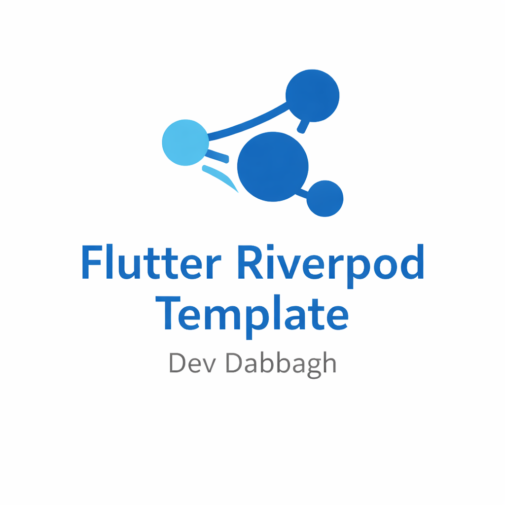

<p align="center">
  
</p>

# 🚀 Flutter Riverpod Clean Architecture Template

[](https://github.com/DevDabbagh/Flutter-Riverpod-Clean-Architecture-Template)
[](https://flutter.dev)
[](https://riverpod.dev)

> **Created By Ahmed Dabbagh (DevDabbagh)**  
> [LinkedIn](https://www.linkedin.com/in/devdabbagh/)

Welcome to the **Flutter Riverpod** Clean Architecture Template! This project is designed to be scalable, maintainable, and easy to work with for the entire team. It combines **Riverpod 3.0**, **Clean Architecture**, and **GoRouter** into a structure similar to GetX but with the power of modern Flutter tools.

---

## 📂 Project Structure

We follow a strict separation of concerns into **App Core** and **Feature Layers**.

```
lib/
├── app/                  # Global Configuration & Core Logic
│   ├── config/           # Constants, AppColors, Assets
│   ├── core/             # Errors, UseCases, specialized Utils
│   ├── network/          # DioHelper, Interceptors, Global Exception Handling
│   ├── router/           # AppRouter (GoRouter setup)
│   ├── theme/            # AppTheme (Light/Dark mode)
│   └── widgets/          # Reusable Global Components (Loaders, Dialogs, Buttons)
│
├── layers/               # Feature-Based Clean Architecture
│   └── [feature_name]/   # e.g., 'posts', 'auth', 'profile'
│       ├── domain/       # PURE DART (No UI, No JSON)
│       │   ├── entities/
│       │   └── repositories/ (Interfaces only)
│       ├── data/         # DATA IMPLEMENTATION
│       │   ├── models/   (fromJson/toJson)
│       │   ├── datasources/ (Retrofit APIs)
│       │   └── repositories/ (Implementation of Domain Repos)
│       └── presentation/ # UI & STATE
│           ├── controllers/ (Riverpod Providers)
│           └── [feature]_page.dart
```

---

## 🛠️ Key Technologies

-   **State Management**: [Riverpod 3.0](https://riverpod.dev) (Generators & Annotations)
-   **Navigation**: [GoRouter](https://pub.dev/packages/go_router)
-   **Networking**: [Dio](https://pub.dev/packages/dio) + [Retrofit](https://pub.dev/packages/retrofit)
-   **JSON Parsing**: [JsonSerializable](https://pub.dev/packages/json_serializable)
-   **Functional Utils**: [Dartz](https://pub.dev/packages/dartz) (Either<L, R>)
-   **UI Sizing**: [Flutter ScreenUtil](https://pub.dev/packages/flutter_screenutil) (Responsive Design)

---

## 🚀 Getting Started

### 1. Prerequisites
- Flutter SDK (3.0 or later)
- Dart SDK (3.0 or later)
- Android Studio / Xcode (for mobile development)

> **✨ One-Click Setup Available!**  
> Once you have the prerequisites, you can set up the entire project with a single command (see below).

### 2. Installation
Clone the repo and install dependencies:
```bash
git clone https://github.com/DevDabbagh/Flutter-Riverpod-Clean-Architecture-Template.git
cd Flutter-Riverpod-Clean-Architecture-Template
flutter pub get
```

### 3. Code Generation (Crucial Step)
This project uses code generation for Riverpod, Retrofit, JSON, Assets, and Localization.
You **MUST** run these commands to generate the necessary files:

```bash
# 1. Generate Models, Providers, and Assets
dart run build_runner build --delete-conflicting-outputs

# 2. Generate Native Splash Screen (from assets/images/ic_logo.png)
dart run flutter_native_splash:create
```

*Note: If you see errors about missing `Assets` or `AppLocalizations` classes, running the above commands will fix them.*

### 4. Running the App
```bash
flutter run
```

### 5. VS Code Extensions (Recommended)
- **Flutter Riverpod Snippets**: For easy provider creation.
- **Dart Data Class Generator**: For generating copyWith, toMap, etc (if not using freezed).

---

## 📝 How to Add a New Feature

Follow this workflow to keep the code clean and consistent. Example: **Auth**.

### Step 1: Domain (The Contract)
Define *what* the feature does, not *how*.
1.  Create **Entity**: `layers/auth/domain/entities/user.dart`.
2.  Create **Repository Interface**: `layers/auth/domain/repositories/auth_repository.dart`.

```dart
abstract class AuthRepository {
  Future<Either<Failure, User>> login(String email, String password);
}
```

### Step 2: Data (The Implementation)
Implement the contract using APIs or Database.
1.  Create **Model**: `layers/auth/data/models/user_model.dart` (extends Entity, adds `fromJson`).
2.  Create **RemoteDataSource**: `layers/auth/data/datasources/auth_remote_datasource.dart` (Retrofit interface).
    ```dart
    @RestApi()
    abstract class AuthRemoteDataSource {
      @POST(ApiEndPoints.login)
      Future<UserModel> login(@Body() Map<String, dynamic> body);
    }
    ```
3.  Create **Repository Impl**: `layers/auth/data/repositories/auth_repository_impl.dart`.
    -   *Catch exceptions here and convert them to `Failure` objects.*

### Step 3: Presentation (The UI)
Connect data to the screen using Providers.
1.  Create **Controller/Provider**: `layers/auth/presentation/controllers/auth_controller.dart`.
    ```dart
    @riverpod
    class AuthController extends _$AuthController {
      @override
      FutureOr<User?> build() => null; // Initial state

      Future<void> login(String email, String password) async {
        state = const AsyncLoading();
        final result = await ref.read(authRepositoryProvider).login(email, password);
        result.fold(
          (failure) => state = AsyncError(failure.message, StackTrace.current),
          (user) => state = AsyncData(user),
        );
      }
    }
    ```
2.  Create **Page**: `layers/auth/presentation/login_page.dart`.
    -   Use `ref.watch(authControllerProvider)` to listen to state.
    -   Use `ref.read(authControllerProvider.notifier).login(...)` to trigger actions.

### Step 4: Routing
Add the new page to `lib/app/router/app_router.dart`.
```dart
GoRoute(
  path: '/login',
  builder: (context, state) => const LoginPage(),
),
```

---

## 🎨 UI & Theme Guidelines

-   **Colors**: Always use `AppColors` (e.g., `AppColors.primaryTeal`). **Do not** hardcode hex colors.
-   **Sizing**: Use `.w`, `.h`, `.sp` from ScreenUtil (e.g., `20.w`, `16.sp`).
-   **Text**: Use `Theme.of(context).textTheme` styles (e.g., `displayMedium`, `bodyLarge`).
-   **Assets**: Add images to `assets/images/` and run `dart run build_runner build` to generating `Assets.gen.dart`.
    -   Usage: `Assets.images.logo.image()` or `Assets.images.icon.svg()`.

---

## 🌐 Networking Tips

-   **Base URL**: Change it in `lib/app/config/constants.dart`.
-   **Globals**: `DioHelper` automatically adds Authorization headers using the token in `SharedPreferences`.
-   **Error Handling**: `DioExceptions` (in `core/errors`) handles 401, 500, etc., and shows a global SnackBar automatically if used.

---

## ⚠️ Troubleshooting

**"Final variable must be assigned" / Build Errors**:
This usually happens if dependencies are out of sync. We use the latest versions (Riverpod 3, Retrofit Generator 10).
Run:
```bash

flutter pub upgrade
dart run build_runner build --delete-conflicting-outputs

```

Happy Coding! 💙
